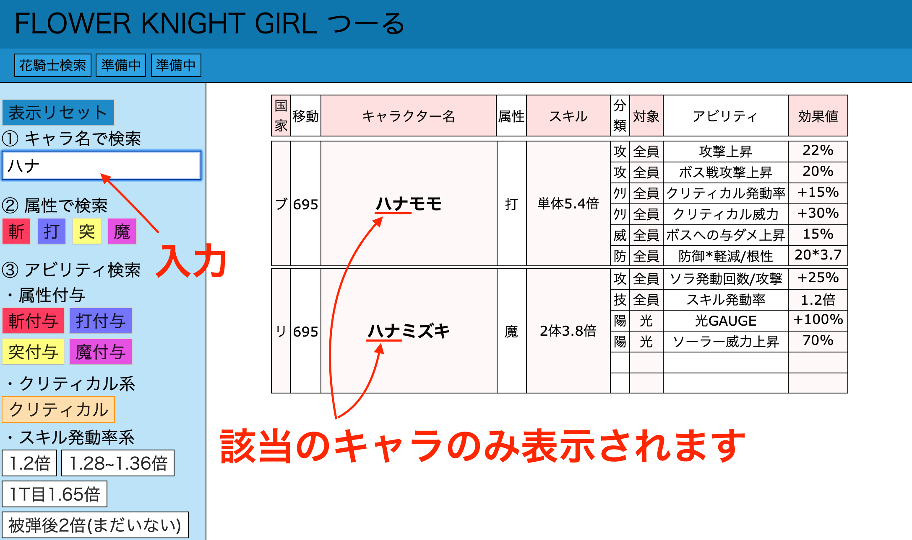
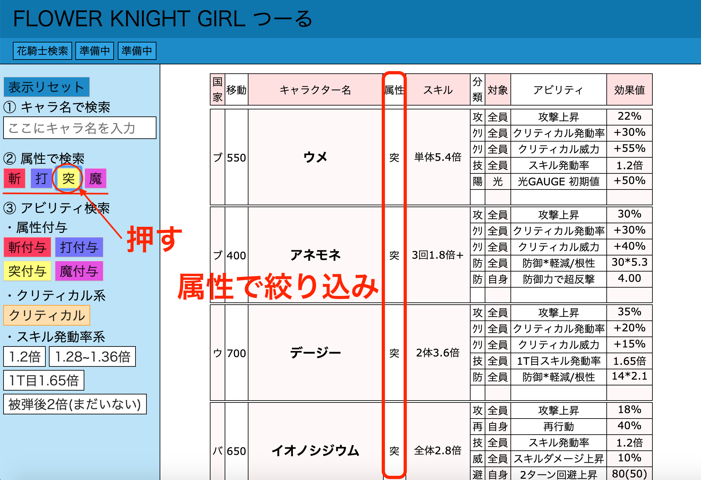
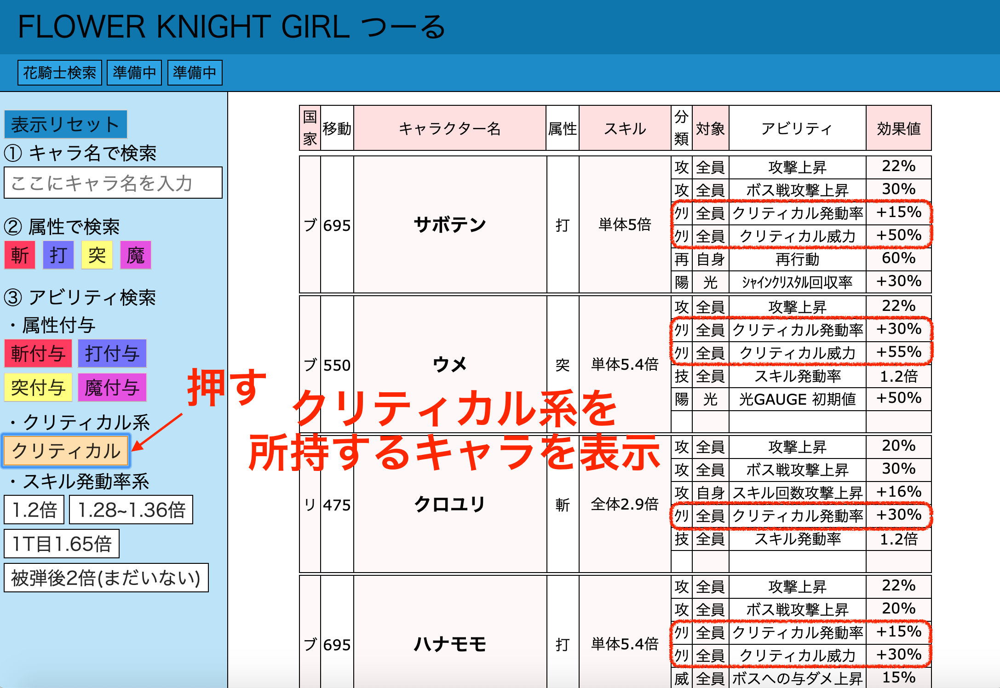
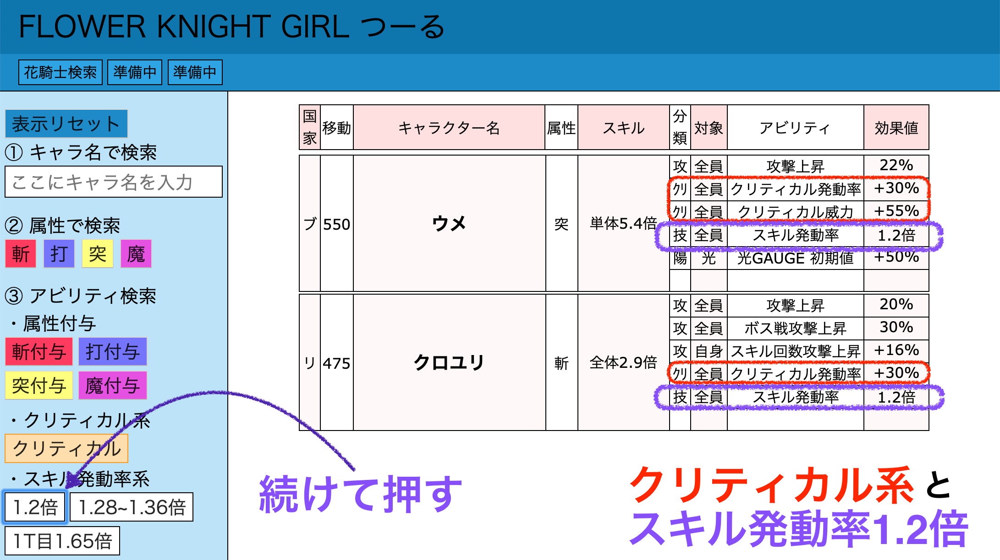

<!-- # README

This README would normally document whatever steps are necessary to get the
application up and running.

Things you may want to cover:

* Ruby version

* System dependencies

* Configuration

* Database creation

* Database initialization

* How to run the test suite

* Services (job queues, cache servers, search engines, etc.)

* Deployment instructions

* ... -->

# アプリ概要
DMM.comラボ提供のブラウザゲーム『FLOWER KNIGHT GIRL〜フラワーナイトガール〜』のデータ検索ツールです。  
デモページ公開中です(AWS) → http://13.115.62.41  

## 企画背景
自分自身、このゲームが好きで3年以上毎日継続して遊んでいて2020年5月現在も続けています。  
攻略していく中でwiki等の攻略Webサイトを利用した事があったが、とにかく不要なデータが大量にあるせいで
利用しづらく、同じ意見をSNSの交流の中だけでもかなり聞いていたので自分で作成しようと本アプリを開発しました。  

## 開発環境
- Haml
- Sass
- jQuery
- Ruby on Rails
- AWS(EC2)
- nginx
- MySQL

## 機能
- キャラクターデータ検索機能

## 今後実装する機能等
- 検索条件とキャラクター情報の追加
- 視認性の向上
- データの一時保存機能
- 詳細画面機能

## 使い方
### キャラクターデータ検索機能  
① キャラ名で検索  
例「ハナ」を含むキャラクターを検索
  
  
② 属性で検索  
例「突属性」のキャラクターを検索  
  
  
③ アビリティで検索  
例1 「クリティカル」に関するアビリティを所持するキャラクターを検索  
  
  
例2 『例1』で表示されたキャラクターの中から「スキル発動率系 1.2倍」を所持するキャラクターを絞り込み検索  

